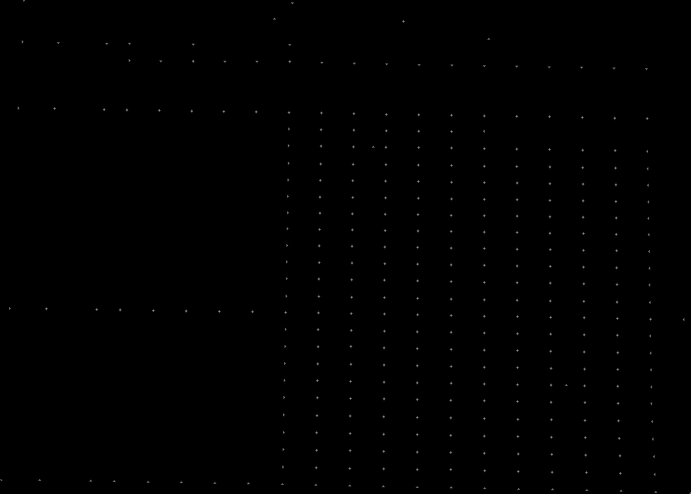
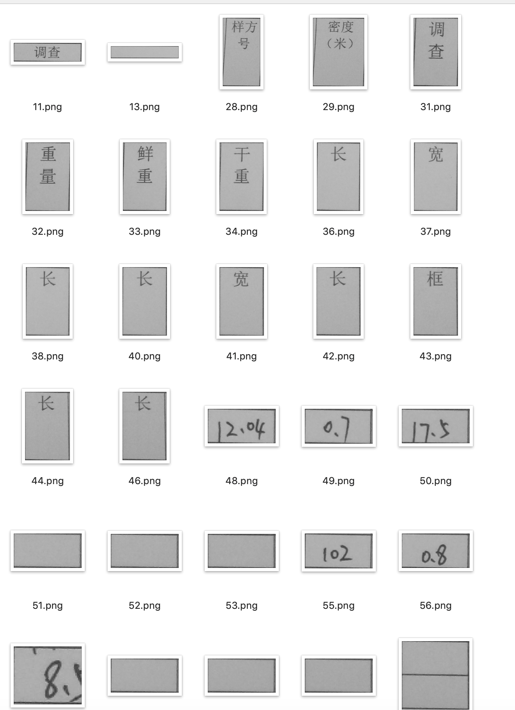

# OCR-MobilePhone-captured-form-image-recognition
The software could extract form content (mainly digital numbers) from mobile phone captured photos. It could recognizes the location (columns and rows of the form) of each cell, thus we could restore the data structure of form and inport to database.

### Pipeline
1. Image Preprocessing (Image gray scale, edge enhancement, banarization)
2. Form area extraction.
3. Line detection (vertical and horizontal)
4. Key points detection and cells extraction (record the coulmns and rows of wach cell)
5. Content recognition using tensorflow (mainly digitis numbers recognition)
6. Inport into database

### Denpidencies
  ``python3.6``,``opencv-python``,``pillow``,``tensorflow``
  
### Usage
    cd ../../OCR-MobilePhone-captured-form-image-recognition
    python main.py
    
### Highlights
1. raw image

  

2. edge enhancement

  

2. bin image

  

3. Form area extraction

  

4. lines detection

  
  

5. Key points detection

  

6. Cells extraction

  

